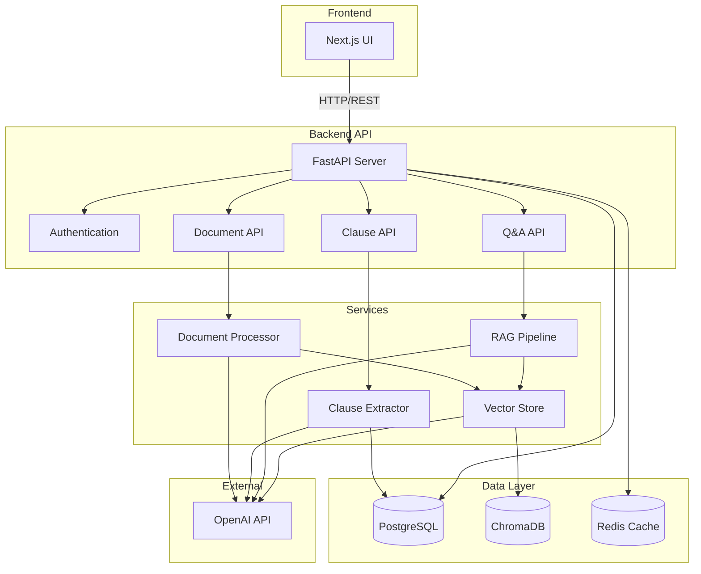

# ContractIQ

**Document Intelligence & RAG Platform for Contract Review**

ContractIQ is a unified platform that combines contract clause extraction with semantic search across multiple documents. Users can review contracts, extract key clauses, identify risks, and ask questions across document sets with citations and evidence packs.

---

## Problem

Contract review is time-consuming and error-prone. Legal teams spend hours manually reviewing contracts to:

- Extract and categorize key clauses
- Identify potential risks and unfavorable terms
- Answer questions about contract terms across multiple documents
- Generate evidence packs for negotiations or compliance

Traditional tools lack the intelligence to understand contract semantics and provide contextual answers with proper citations.

## Solution

ContractIQ leverages AI to automate contract analysis:

- **Intelligent Clause Extraction**: Uses LLM to extract 15+ clause types with risk assessment
- **Semantic Search**: RAG pipeline enables natural language queries across document sets
- **Risk Analysis**: Automated risk scoring and flagging of problematic clauses
- **Evidence Generation**: PDF evidence packs with highlighted excerpts for negotiations

---

## High-Level Architecture



---

## Project File Tree

```
ContractIQ/
├── backend/                    # FastAPI backend
│   ├── src/
│   │   ├── api/                # API endpoints
│   │   │   ├── auth.py         # Authentication
│   │   │   ├── workspaces.py   # Workspace management
│   │   │   ├── documents.py    # Document upload/processing
│   │   │   ├── clauses.py      # Clause extraction
│   │   │   ├── conversations.py # Q&A conversations
│   │   │   └── exports.py      # Export services
│   │   ├── core/               # Core configuration
│   │   │   ├── config.py       # Settings
│   │   │   ├── database.py     # DB connection
│   │   │   ├── auth.py         # JWT authentication
│   │   │   └── cache.py        # Redis caching
│   │   ├── models/             # SQLAlchemy models
│   │   │   ├── user.py
│   │   │   ├── workspace.py
│   │   │   ├── document.py
│   │   │   ├── clause.py
│   │   │   └── conversation.py
│   │   ├── schemas/            # Pydantic schemas
│   │   └── services/           # Business logic
│   │       ├── document_processor.py
│   │       ├── clause_extractor.py
│   │       ├── rag_pipeline.py
│   │       ├── vector_store.py
│   │       └── embedding_service.py
│   ├── alembic/                # Database migrations
│   ├── Dockerfile
│   └── pyproject.toml
├── frontend/                    # Next.js frontend
│   ├── app/                     # App Router pages
│   │   ├── page.tsx            # Home
│   │   ├── documents/           # Document management
│   │   ├── clauses/             # Clause extraction
│   │   ├── qa/                  # Q&A interface
│   │   └── settings/           # Settings
│   ├── components/              # React components
│   │   ├── ui/                  # shadcn/ui components
│   │   ├── layout/              # Layout components
│   │   ├── documents/           # Document components
│   │   ├── clauses/             # Clause components
│   │   └── qa/                  # Q&A components
│   └── lib/
│       └── api.ts               # API client
├── docs/                        # Documentation
│   ├── user-guide/              # User documentation
│   ├── architecture/            # Architecture docs
│   ├── api/                     # API reference
│   └── development/             # Dev docs
├── docker-compose.yml           # Docker services
└── README.md
```

---

## Tech Stack

| Component               | Technology                    | Purpose                                      |
| ----------------------- | ----------------------------- | -------------------------------------------- |
| **Backend Framework**   | FastAPI (Python 3.11+)        | REST API server                              |
| **Database**            | PostgreSQL 16                 | Relational data storage                      |
| **Vector Store**        | ChromaDB                      | Semantic search embeddings                   |
| **Cache**               | Redis 7                       | Caching layer                                |
| **Document Processing** | PyMuPDF                       | PDF text extraction                          |
| **LLM Integration**     | OpenAI GPT-4o-mini            | Document structuring, clause extraction, RAG |
| **RAG Pipeline**        | LangGraph                     | Query processing workflow                    |
| **Embeddings**          | OpenAI text-embedding-3-small | Vector embeddings                            |
| **Frontend Framework**  | Next.js 16                    | React-based UI                               |
| **UI Components**       | shadcn/ui + Tailwind CSS      | Component library                            |
| **Authentication**      | JWT (python-jose)             | User authentication                          |
| **Package Manager**     | uv                            | Python dependency management                 |
| **Containerization**    | Docker & Docker Compose       | Container orchestration                      |

---

## Quick Start

1. **Prerequisites**: Docker, Docker Compose, Node.js 18+

2. **Start Services**:

   ```bash
   docker-compose up -d
   ```

3. **Access Application**:

   - Frontend: http://localhost:3000
   - Backend API: http://localhost:8002
   - API Docs: http://localhost:8002/docs

4. **First Steps**:
   - Register a new account
   - Create a workspace
   - Upload a contract document
   - Wait for processing
   - Extract clauses or ask questions

For detailed setup instructions, see [Development Setup](docs/development/setup.md).

---

## Documentation

- **[User Guide](docs/user-guide/getting-started.md)** - Getting started and user workflows
- **[Architecture](docs/architecture/overview.md)** - System design and architecture
- **[API Reference](docs/api/overview.md)** - Complete API documentation
- **[Development](docs/development/setup.md)** - Development setup and guidelines

---

## Key Features

### Document Processing

- PDF and DOCX support
- Intelligent document structuring using LLM
- Semantic chunking for RAG
- Background processing

### Clause Extraction

- 15+ clause types (Termination, Liability, Payment, IP, etc.)
- Risk scoring (0-100 scale)
- Risk flags and reasoning
- Confidence scores

### Q&A with RAG

- Natural language queries
- Multi-document search
- Citations with page numbers
- Conversation history

### Evidence Packs

- PDF generation with excerpts
- Highlighted citations
- Conversation summaries
- Export for negotiations

---

## License

Private repository - Proprietary
