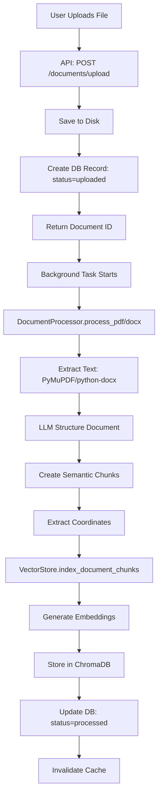
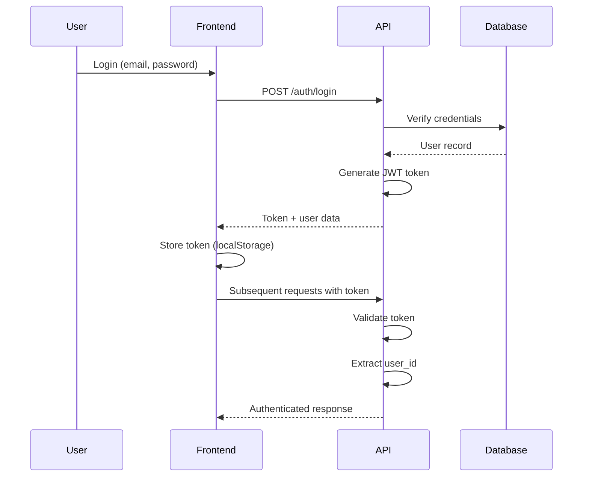
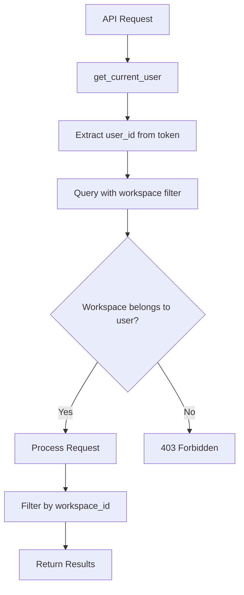
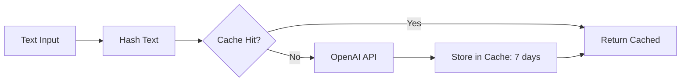
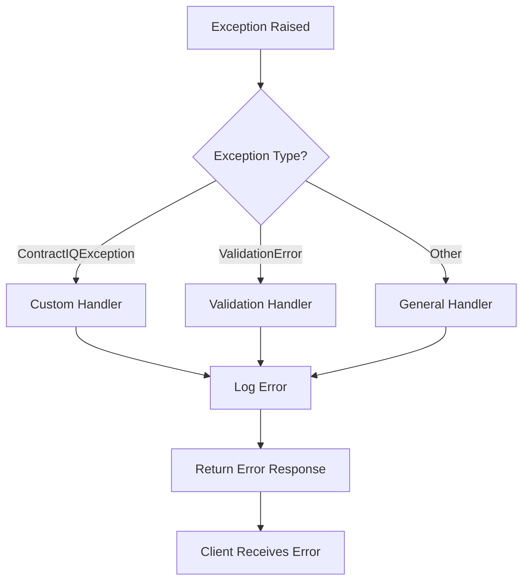

# Data Flow

Complete data flow diagrams for key operations.

---

## Document Processing Flow

### End-to-End Flow



### Processing Details

| Step                | Component           | Output                            |
| ------------------- | ------------------- | --------------------------------- |
| **Text Extraction** | PyMuPDF/python-docx | Raw text + coordinates            |
| **Structuring**     | OpenAI GPT-4o-mini  | Sections, chunks, metadata        |
| **Chunking**        | DocumentProcessor   | Semantic chunks with page numbers |
| **Embedding**       | EmbeddingService    | Vector embeddings (1536 dim)      |
| **Indexing**        | VectorStore         | ChromaDB collection entries       |

---

## Clause Extraction Flow

```mermaid
graph TB
    A[User: Extract Clauses] --> B[API: POST /documents/{id}/extract-clauses]
    B --> C[Get Document from DB]
    C --> D[Get Chunks from Vector Store]
    D --> E[ClauseExtractor.extract_clauses_from_chunks]
    E --> F[Batch Processing: 5 chunks/batch]
    F --> G[LLM: Extract Clauses]
    G --> H[Risk Analysis]
    H --> I[ClauseDeduplicator: Remove Duplicates]
    I --> J[Save to Database]
    J --> K[Return Clauses]
```

### Extraction Process

1. **Retrieve Chunks**: Get all chunks for document from ChromaDB
2. **Batch Processing**: Process 5 chunks at a time (token limits)
3. **LLM Extraction**: Structured output with Instructor
4. **Risk Analysis**: Score (0-100), flags, reasoning
5. **Deduplication**: Remove similar clauses
6. **Storage**: Save to PostgreSQL

---

## RAG Query Flow

### Complete RAG Pipeline

```mermaid
graph TB
    A[User Question] --> B[API: POST /conversations/{id}/ask]
    B --> C[RAGPipeline.ask]
    C --> D[Retrieve Node]
    D --> E[EmbeddingService: Query Embedding]
    E --> F[VectorStore.search]
    F --> G[ChromaDB: Similarity Search]
    G --> H[Filter by Similarity Threshold]
    H --> I[Top 5 Chunks]
    I --> J[Generate Node]
    J --> K[Build Context from Chunks]
    K --> L[LLM: Generate Answer]
    L --> M[Extract Citations]
    M --> N[Save Message to DB]
    N --> O[Return Answer + Citations]
```

### Retrieval Details

| Step                 | Description                     | Output            |
| -------------------- | ------------------------------- | ----------------- |
| **Query Embedding**  | Generate embedding for question | 1536-dim vector   |
| **Vector Search**    | Cosine similarity search        | Ranked chunks     |
| **Filtering**        | Remove low-similarity (< -0.3)  | Top 5 chunks      |
| **Context Building** | Format chunks with metadata     | Formatted context |

### Generation Details

| Step                    | Description                  | Output             |
| ----------------------- | ---------------------------- | ------------------ |
| **Context Assembly**    | Combine chunks with metadata | Source list        |
| **Prompt Building**     | System + user prompts        | LLM prompts        |
| **Structured Output**   | Instructor validation        | Answer + citations |
| **Citation Validation** | Ensure valid source numbers  | Filtered citations |

---

## Authentication Flow



---

## Workspace Isolation Flow



### Isolation Points

1. **Database Queries**: Always filter by `workspace_id`
2. **Vector Store**: Per-workspace collections
3. **File Storage**: Workspace-scoped paths (optional)
4. **Cache Keys**: Include workspace_id

---

## Cache Flow

### Embedding Cache



### Cache Strategy

| Cache Type          | Key Pattern                              | TTL      | Invalidation       |
| ------------------- | ---------------------------------------- | -------- | ------------------ |
| **Embeddings**      | `embedding:{model}:{hash}`               | 7 days   | Never (immutable)  |
| **Vector Search**   | `vector_search:{workspace}:{query_hash}` | 1 hour   | On document update |
| **Workspace Stats** | `workspace_stats:{workspace_id}`         | 1 minute | On any change      |

---

## Error Flow



### Error Handling

- **Custom Exceptions**: Structured error codes
- **Validation Errors**: Field-level details
- **General Errors**: Error ID for tracking
- **Logging**: Context-rich logs with error IDs

---

## Next Steps

- **[Database Schema](database-schema.md)** - Entity relationships
- **[Vector Store](vector-store.md)** - Embedding architecture
