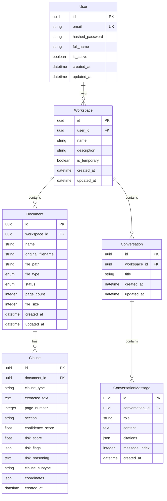

# Database Schema

Entity relationship diagram and table descriptions.

---

## Entity Relationship Diagram



---

## Tables

### users

| Column | Type | Constraints | Description |
|--------|------|-------------|-------------|
| `id` | UUID | PRIMARY KEY | User identifier |
| `email` | VARCHAR(255) | UNIQUE, NOT NULL | User email |
| `hashed_password` | VARCHAR(255) | NOT NULL | Bcrypt hashed password |
| `full_name` | VARCHAR(255) | NULL | User's full name |
| `is_active` | BOOLEAN | NOT NULL, DEFAULT true | Account status |
| `created_at` | TIMESTAMP | NOT NULL | Creation timestamp |
| `updated_at` | TIMESTAMP | NOT NULL | Last update timestamp |

**Indexes**: `email`

---

### workspaces

| Column | Type | Constraints | Description |
|--------|------|-------------|-------------|
| `id` | UUID | PRIMARY KEY | Workspace identifier |
| `user_id` | UUID | FOREIGN KEY → users.id, NOT NULL | Owner user |
| `name` | VARCHAR(255) | NOT NULL | Workspace name |
| `description` | VARCHAR(1000) | NULL | Workspace description |
| `is_temporary` | BOOLEAN | NOT NULL, DEFAULT false | Temporary flag |
| `created_at` | TIMESTAMP | NOT NULL | Creation timestamp |
| `updated_at` | TIMESTAMP | NOT NULL | Last update timestamp |

**Indexes**: `user_id`

**Relationships**:
- One-to-many with `documents`
- One-to-many with `conversations`
- Many-to-one with `users`

---

### documents

| Column | Type | Constraints | Description |
|--------|------|-------------|-------------|
| `id` | UUID | PRIMARY KEY | Document identifier |
| `workspace_id` | UUID | FOREIGN KEY → workspaces.id, NOT NULL | Parent workspace |
| `name` | VARCHAR(255) | NOT NULL | Display name |
| `original_filename` | VARCHAR(255) | NOT NULL | Original filename |
| `file_path` | VARCHAR(1000) | NOT NULL | Storage path |
| `file_type` | ENUM('pdf', 'docx') | NOT NULL | File type |
| `status` | ENUM('uploaded', 'processing', 'processed', 'failed') | NOT NULL, DEFAULT 'uploaded' | Processing status |
| `page_count` | INTEGER | NULL | Number of pages |
| `file_size` | INTEGER | NOT NULL | File size in bytes |
| `created_at` | TIMESTAMP | NOT NULL | Creation timestamp |
| `updated_at` | TIMESTAMP | NOT NULL | Last update timestamp |

**Indexes**: `workspace_id`

**Relationships**:
- Many-to-one with `workspaces`
- One-to-many with `clauses`

**Status Flow**: `uploaded` → `processing` → `processed` (or `failed`)

---

### clauses

| Column | Type | Constraints | Description |
|--------|------|-------------|-------------|
| `id` | UUID | PRIMARY KEY | Clause identifier |
| `document_id` | UUID | FOREIGN KEY → documents.id, NOT NULL | Parent document |
| `clause_type` | VARCHAR(100) | NOT NULL | Type (e.g., "Termination") |
| `extracted_text` | TEXT | NOT NULL | Full clause text |
| `page_number` | INTEGER | NOT NULL | Page where clause appears |
| `section` | VARCHAR(255) | NULL | Section name |
| `confidence_score` | FLOAT | NULL | Extraction confidence (0-1) |
| `risk_score` | FLOAT | NULL, DEFAULT 0.0 | Risk score (0-100) |
| `risk_flags` | JSON | NULL | Array of risk flags |
| `risk_reasoning` | TEXT | NULL | Risk explanation |
| `clause_subtype` | VARCHAR(100) | NULL | Subtype classification |
| `coordinates` | JSON | NULL | PDF coordinates for highlighting |
| `created_at` | TIMESTAMP | NOT NULL | Creation timestamp |

**Indexes**: `document_id`, `clause_type`, `risk_score`

**Relationships**:
- Many-to-one with `documents`

**Clause Types**: Termination, Payment, Liability, Indemnification, IP, Confidentiality, etc.

---

### conversations

| Column | Type | Constraints | Description |
|--------|------|-------------|-------------|
| `id` | UUID | PRIMARY KEY | Conversation identifier |
| `workspace_id` | UUID | FOREIGN KEY → workspaces.id, NOT NULL | Parent workspace |
| `title` | VARCHAR(255) | NULL | Conversation title |
| `created_at` | TIMESTAMP | NOT NULL | Creation timestamp |
| `updated_at` | TIMESTAMP | NOT NULL | Last update timestamp |

**Indexes**: `workspace_id`

**Relationships**:
- Many-to-one with `workspaces`
- One-to-many with `conversation_messages`

---

### conversation_messages

| Column | Type | Constraints | Description |
|--------|------|-------------|-------------|
| `id` | UUID | PRIMARY KEY | Message identifier |
| `conversation_id` | UUID | FOREIGN KEY → conversations.id, NOT NULL | Parent conversation |
| `role` | VARCHAR(20) | NOT NULL | 'user' or 'assistant' |
| `content` | TEXT | NOT NULL | Message content |
| `citations` | JSON | NULL | Array of citation objects |
| `message_index` | INTEGER | NOT NULL | Order in conversation |
| `created_at` | TIMESTAMP | NOT NULL | Creation timestamp |

**Indexes**: `conversation_id`, `message_index`

**Relationships**:
- Many-to-one with `conversations`

**Citation Format**:
```json
{
  "document_id": "uuid",
  "document_name": "string",
  "page_number": 1,
  "section_name": "string",
  "text_excerpt": "string",
  "similarity_score": 0.85
}
```

---

## Relationships Summary

| Relationship | Type | Cascade |
|--------------|------|---------|
| User → Workspace | One-to-Many | DELETE (orphan) |
| Workspace → Document | One-to-Many | DELETE (orphan) |
| Workspace → Conversation | One-to-Many | DELETE (orphan) |
| Document → Clause | One-to-Many | DELETE (orphan) |
| Conversation → Message | One-to-Many | DELETE (orphan) |

---

## Constraints

### Foreign Keys
- `workspaces.user_id` → `users.id`
- `documents.workspace_id` → `workspaces.id`
- `clauses.document_id` → `documents.id`
- `conversations.workspace_id` → `workspaces.id`
- `conversation_messages.conversation_id` → `conversations.id`

### Unique Constraints
- `users.email` (unique)

### Check Constraints
- `clauses.risk_score` BETWEEN 0 AND 100
- `clauses.confidence_score` BETWEEN 0 AND 1
- `documents.status` IN ('uploaded', 'processing', 'processed', 'failed')
- `documents.file_type` IN ('pdf', 'docx')
- `conversation_messages.role` IN ('user', 'assistant')

---

## Migrations

Migrations managed with Alembic:
- Location: `backend/alembic/versions/`
- Initial migration: `ee476f61c318_initial_migration.py`
- Auth migration: `a1b2c3d4e5f6_add_user_auth_and_workspace_user_id.py`
- Risk fields: `ce01b6abad24_add_risk_score_risk_reasoning_clause_.py`

---

## Next Steps

- **[Vector Store](vector-store.md)** - Embedding architecture

