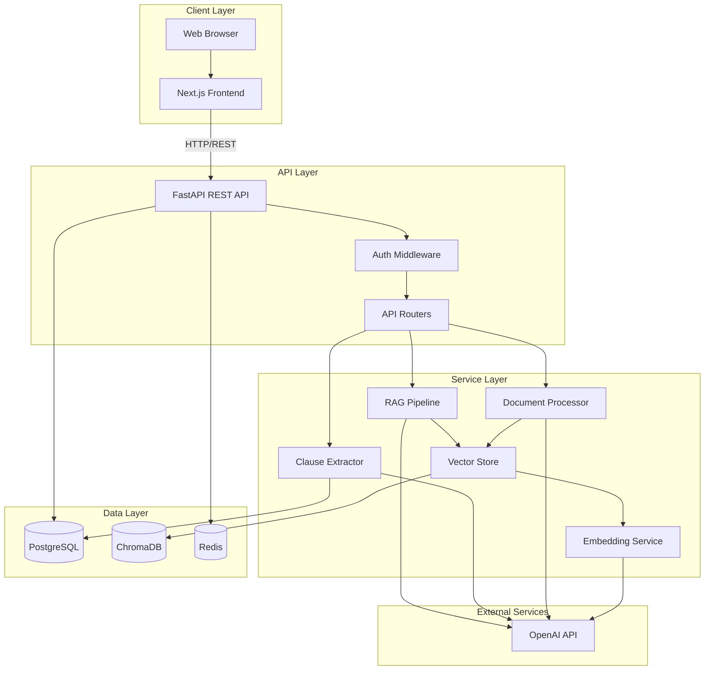
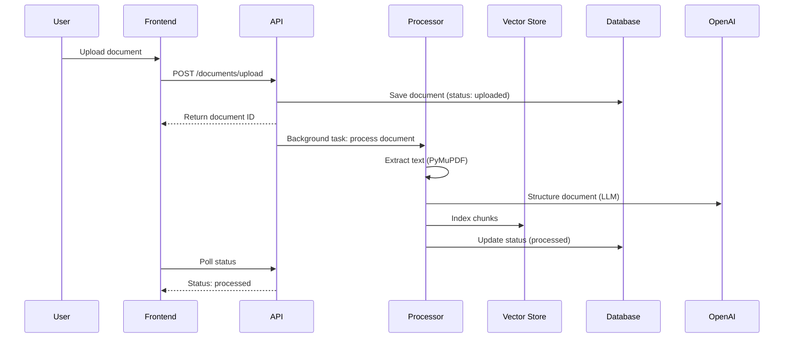
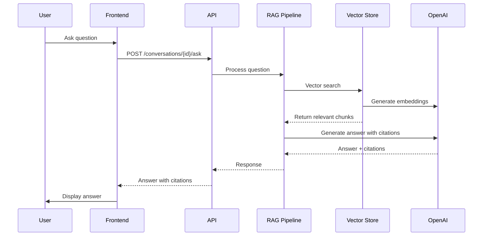

# Architecture Overview

High-level system architecture and design principles for ContractIQ.

---

## System Components

---

## Component Responsibilities

| Component | Responsibility | Technology |
|-----------|--------------|------------|
| **Frontend** | User interface, document viewing, Q&A chat | Next.js 16, React, shadcn/ui |
| **API Server** | REST endpoints, request routing, authentication | FastAPI, Python 3.11+ |
| **Document Processor** | PDF/DOCX parsing, text extraction, LLM structuring | PyMuPDF, python-docx, OpenAI |
| **Clause Extractor** | Clause identification, risk analysis | OpenAI GPT-4o-mini, Instructor |
| **RAG Pipeline** | Semantic search, answer generation | LangGraph, ChromaDB, OpenAI |
| **Vector Store** | Embedding storage, similarity search | ChromaDB |
| **Database** | Relational data (users, workspaces, documents, clauses) | PostgreSQL 16 |
| **Cache** | Performance optimization, embedding cache | Redis 7 |

---

## Architecture Principles

### 1. **Separation of Concerns**
- API layer handles HTTP requests/responses
- Service layer contains business logic
- Data layer manages persistence

### 2. **Workspace Isolation**
- Each workspace has isolated data
- Per-workspace ChromaDB collections
- Database-level workspace filtering

### 3. **Background Processing**
- Document processing runs asynchronously
- Non-blocking API responses
- Status updates via polling

### 4. **Caching Strategy**
- Embeddings cached (7 days TTL)
- Vector search results cached (1 hour)
- Workspace stats cached (1 minute)

### 5. **Error Handling**
- Custom exception hierarchy
- Structured error responses
- Comprehensive logging

---

## Data Flow

### Document Upload Flow

### Q&A Flow

---

## Technology Choices

| Choice | Rationale |
|--------|-----------|
| **FastAPI** | Fast, async, automatic OpenAPI docs, type safety |
| **PostgreSQL** | Reliable, ACID compliance, complex queries |
| **ChromaDB** | Simple, embedded, per-workspace collections |
| **Redis** | Fast caching, session storage |
| **OpenAI GPT-4o-mini** | Cost-effective, structured output support |
| **LangGraph** | Workflow orchestration, state management |
| **Next.js** | Server-side rendering, API routes, React ecosystem |

---

## Security

- **Authentication**: JWT tokens with 7-day expiration
- **Authorization**: Workspace-level access control
- **Data Isolation**: Per-workspace collections and queries
- **File Upload**: Size limits, type validation
- **CORS**: Configurable origins

---

## Scalability Considerations

- **Horizontal Scaling**: Stateless API servers
- **Background Jobs**: Async processing prevents blocking
- **Caching**: Reduces database and API load
- **Vector Store**: Per-workspace collections enable sharding
- **Database**: Connection pooling, query optimization

---

## Next Steps

- **[System Design](system-design.md)** - Detailed component design
- **[Data Flow](data-flow.md)** - Complete data flow diagrams
- **[Database Schema](database-schema.md)** - Entity relationships
- **[Vector Store](vector-store.md)** - Embedding architecture

