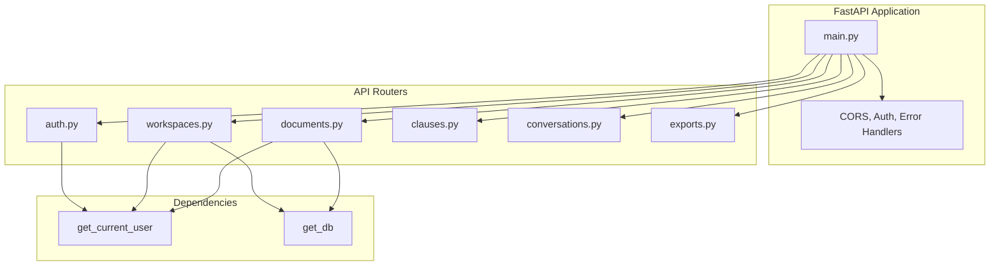
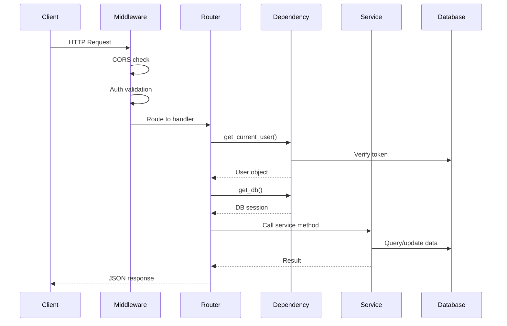
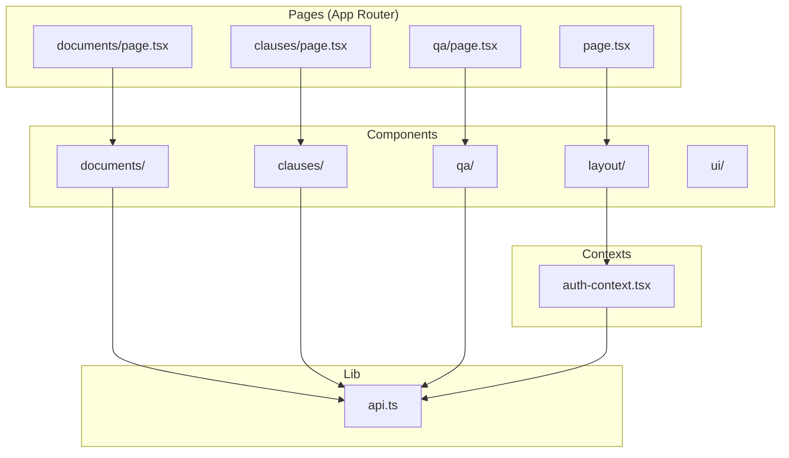
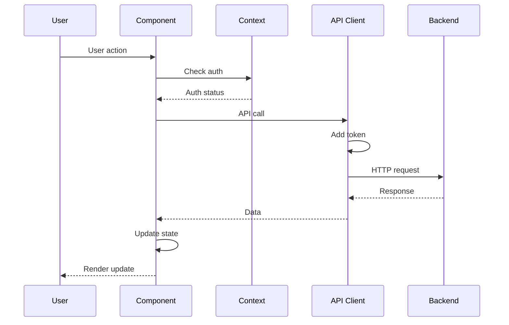
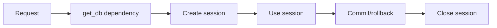
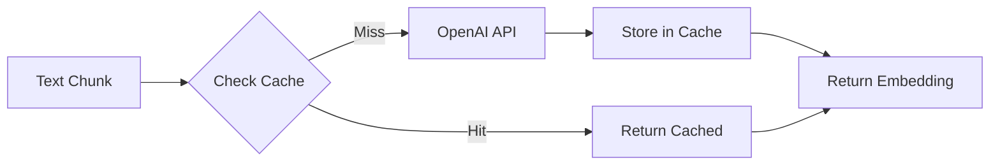

# System Design

Detailed design of backend and frontend components.

---

## Backend Architecture

### API Layer Structure



### Service Layer

| Service               | Purpose                               | Key Methods                                 |
| --------------------- | ------------------------------------- | ------------------------------------------- |
| **DocumentProcessor** | Parse PDF/DOCX, structure with LLM    | `process_pdf()`, `process_docx()`           |
| **ClauseExtractor**   | Extract clauses with risk analysis    | `extract_clauses_from_chunks()`             |
| **RAGPipeline**       | Semantic search and answer generation | `ask()`                                     |
| **VectorStore**       | Embedding storage and search          | `index_document_chunks()`, `search()`       |
| **EmbeddingService**  | Generate embeddings with caching      | `get_embedding()`, `get_embeddings_batch()` |

### Request Flow



---

## Frontend Architecture

### Component Structure



### State Management

- **Auth Context**: Global authentication state
- **Local State**: React hooks for component state
- **API Client**: Centralized API calls with token management

### Data Flow



---

## Service Design Patterns

### 1. **Dependency Injection**

- FastAPI dependencies for database sessions
- Service instances created at module level
- Easy testing with mock dependencies

### 2. **Background Tasks**

- FastAPI `BackgroundTasks` for async processing
- Non-blocking document processing
- Status polling from frontend

### 3. **Caching Strategy**

- Multi-level caching (Redis + in-memory)
- TTL-based expiration
- Cache invalidation on updates

### 4. **Error Handling**

- Custom exception hierarchy
- Structured error responses
- Logging with context

---

## Database Design

### Connection Management

```python
# Connection pooling
engine = create_engine(
    database_url,
    pool_pre_ping=True,      # Verify connections
    pool_size=10,            # Base pool size
    max_overflow=20             # Additional connections
)
```

### Session Lifecycle



---

## Vector Store Design

### Collection Structure

- **Naming**: `workspace_{workspace_id}`
- **Metadata**: `document_id`, `page_number`, `section_name`, `chunk_id`
- **Isolation**: Per-workspace collections

### Embedding Pipeline



---

## API Design Patterns

### RESTful Endpoints

| Pattern | Example            | Method |
| ------- | ------------------ | ------ |
| List    | `/workspaces/`     | GET    |
| Get     | `/workspaces/{id}` | GET    |
| Create  | `/workspaces/`     | POST   |
| Update  | `/workspaces/{id}` | PATCH  |
| Delete  | `/workspaces/{id}` | DELETE |

### Response Format

```json
{
  "id": "uuid",
  "name": "string",
  "created_at": "iso8601",
  ...
}
```

### Error Format

```json
{
  "error": true,
  "error_code": "NOT_FOUND",
  "message": "User-friendly message",
  "details": {},
  "timestamp": "iso8601"
}
```

---

## Next Steps

- **[Data Flow](data-flow.md)** - Complete data flow diagrams
- **[Database Schema](database-schema.md)** - Entity relationships
- **[Vector Store](vector-store.md)** - Embedding architecture
