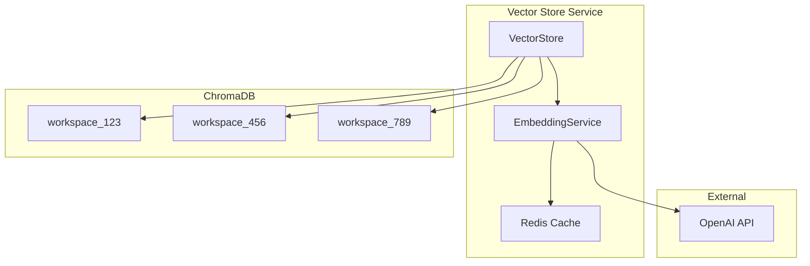
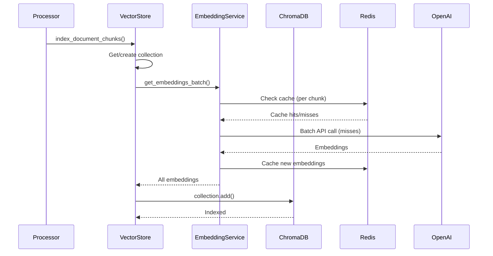
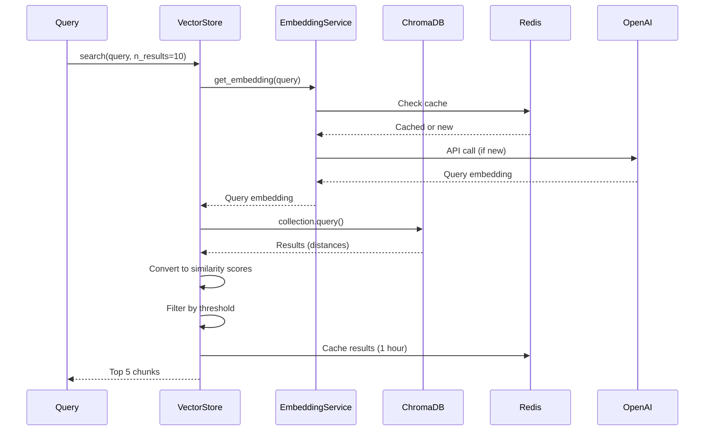

# Vector Store Architecture

ChromaDB-based vector store for semantic search.

---

## Overview

The vector store enables semantic search across document chunks using embeddings. Each workspace has an isolated collection.

---

## Architecture



---

## Collection Structure

### Naming Convention

- **Pattern**: `workspace_{workspace_id}`
- **Example**: `workspace_550e8400-e29b-41d4-a716-446655440000`
- **Isolation**: Each workspace has separate collection

### Collection Metadata

```json
{
  "workspace_id": "550e8400-e29b-41d4-a716-446655440000"
}
```

---

## Document Structure

### Chunk Entry

| Field | Type | Description |
|-------|------|-------------|
| `id` | string | Unique chunk ID (e.g., `chunk_{doc_id}_{index}`) |
| `document` | string | Chunk text content |
| `embedding` | float[1536] | Vector embedding |
| `metadata` | dict | Chunk metadata |

### Metadata Schema

```json
{
  "workspace_id": "uuid",
  "document_id": "uuid",
  "document_name": "string",
  "page_number": 1,
  "section_name": "string",
  "chunk_type": "chunk",
  "type": "chunk",
  "coordinates": "{\"x0\": 0, \"y0\": 0, \"x1\": 100, \"y1\": 100, \"page\": 1}"
}
```

**Note**: `coordinates` stored as JSON string (ChromaDB limitation)

---

## Embedding Pipeline

### Generation Flow


### Embedding Service

| Method | Purpose | Caching |
|--------|---------|---------|
| `get_embedding(text)` | Single embedding | Yes (7 days) |
| `get_embeddings_batch(texts)` | Batch embeddings | Per-text cache |

### Cache Strategy

- **Key**: `embedding:{model}:{text_hash}`
- **TTL**: 7 days (immutable)
- **Storage**: Redis

---

## Indexing Flow

### Document Indexing



### Batch Processing

- **Batch Size**: All chunks in one call (OpenAI supports up to 2048)
- **Error Handling**: Failed embeddings return `None`, skipped
- **Validation**: Empty chunks filtered out

---

## Search Flow

### Query Processing



### Search Parameters

| Parameter | Default | Description |
|-----------|---------|-------------|
| `n_results` | 10 | Initial results to fetch |
| `filter_metadata` | None | Metadata filters |
| `include_clauses` | True | Include clause results |
| `include_chunks` | True | Include chunk results |

### Similarity Calculation

- **Distance**: ChromaDB returns cosine distance
- **Similarity**: `similarity = 1 - distance`
- **Range**: Can be negative (opposite vectors)
- **Threshold**: Filter results with similarity > -0.3

---

## Filtering

### Metadata Filters

```python
# Filter by document
filter_metadata = {"document_id": "uuid"}

# Filter by type
filter_metadata = {"type": "chunk"}  # or "clause"
```

### Post-Query Filtering

- **Document IDs**: Filter results after retrieval
- **Similarity Threshold**: Remove low-relevance results
- **Top-K**: Keep top 5 by similarity score

---

## Caching Strategy

### Search Results Cache

| Cache Key | Pattern | TTL |
|-----------|---------|-----|
| **Vector Search** | `vector_search:{workspace}:{query_hash}:{n_results}:{filters}` | 1 hour |

### Cache Invalidation

- **On Document Update**: Invalidate workspace cache
- **On Document Delete**: Remove from collection
- **On Workspace Delete**: Delete entire collection

---

## Performance Optimizations

### 1. **Embedding Cache**
- 7-day TTL (embeddings are immutable)
- Reduces OpenAI API calls
- Significant cost savings

### 2. **Batch Embeddings**
- Process multiple texts in one API call
- More efficient than sequential calls
- OpenAI supports up to 2048 inputs

### 3. **Result Caching**
- Cache search results for 1 hour
- Same queries return instantly
- Workspace-level cache keys

### 4. **Collection Isolation**
- Per-workspace collections
- Faster queries (smaller collections)
- Easy cleanup (delete collection)

---

## Data Management

### Adding Documents

```python
vector_store.index_document_chunks(
    workspace_id="uuid",
    document_id="uuid",
    document_name="contract.pdf",
    chunks=[...]  # List of chunk dicts
)
```

### Deleting Documents

```python
# Delete all chunks for a document
vector_store.delete_document(
    workspace_id="uuid",
    document_id="uuid"
)
```

### Deleting Workspaces

```python
# Delete entire collection
vector_store.delete_workspace(workspace_id="uuid")
```

---

## Storage Location

- **Path**: `./chroma_db/` (configurable)
- **Format**: ChromaDB persistent storage
- **Backup**: Include in database backups

---

## Limitations

1. **Metadata Types**: ChromaDB only supports strings/numbers (JSON strings for complex types)
2. **Collection Size**: No hard limit, but large collections may be slower
3. **Embedding Dimension**: Fixed at 1536 (text-embedding-3-small)
4. **Distance Metric**: Cosine distance (not configurable)

---

## Next Steps

- **[API Reference](../api/overview.md)** - API documentation
- **[Development Guide](../development/setup.md)** - Setup instructions

