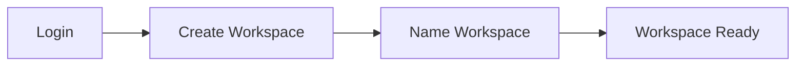
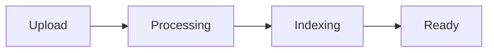

# Getting Started

This guide will help you get started with ContractIQ.

---

## Prerequisites

| Requirement | Minimum | Recommended |
|------------|---------|-------------|
| **Browser** | Chrome 90+, Firefox 88+, Safari 14+ | Latest version |
| **Internet** | Required for OpenAI API | Stable connection |
| **File Size** | Up to 50MB | < 20MB for faster processing |
| **File Types** | PDF, DOCX | PDF (best support) |

---

## Supported File Formats

| Format | Support | Notes |
|-------|---------|-------|
| PDF | ✅ Full | Best support, accurate page numbers |
| DOCX | ✅ Full | Page numbers approximated |

---

## Installation

### Using Docker (Recommended)

1. **Clone the repository**:
   ```bash
   git clone <repository-url>
   cd ContractIQ
   ```

2. **Start services**:
   ```bash
   docker-compose up -d
   ```

3. **Verify services**:
   - Frontend: http://localhost:3000
   - Backend: http://localhost:8002
   - API Docs: http://localhost:8002/docs

### Manual Setup

See [Development Setup](../development/setup.md) for manual installation instructions.

---

## First Steps

### 1. Create an Account

1. Navigate to http://localhost:3000
2. Click **Register**
3. Enter your email and password
4. Click **Create Account**

### 2. Create Your First Workspace



1. After login, you'll see the workspace selector
2. Click **Create Workspace**
3. Enter a name (e.g., "Q4 Contracts")
4. Optionally add a description
5. Click **Create**

### 3. Upload Your First Document

1. Navigate to **Documents** page
2. Click **Upload Document**
3. Select a PDF or DOCX file
4. Wait for processing (status updates automatically)

**Processing Flow**:


### 4. Extract Clauses

1. Go to **Clauses** page
2. Select a processed document
3. Click **Extract Clauses**
4. Review extracted clauses with risk scores

### 5. Ask Your First Question

1. Navigate to **Q&A** page
2. Start a new conversation
3. Ask a question like: "What are the termination terms?"
4. Review the answer with citations

---

## Next Steps

- **[Workspace Management](workspaces.md)** - Organize your documents
- **[Document Management](documents.md)** - Upload and process documents
- **[Clause Extraction](clause-extraction.md)** - Extract and analyze clauses
- **[Q&A Conversations](qa-conversations.md)** - Ask questions about contracts
- **[Evidence Packs](evidence-packs.md)** - Generate PDF evidence packs

---

## Troubleshooting

### Document Processing Fails

- **Check file format**: Ensure PDF or DOCX
- **Check file size**: Must be < 50MB
- **Check file integrity**: File may be corrupted
- **Check logs**: Review backend logs for errors

### Questions Return No Results

- **Verify documents are processed**: Status should be "processed"
- **Check workspace**: Ensure documents are in the correct workspace
- **Rephrase question**: Try more specific questions
- **Check document content**: Ensure documents contain relevant text

### Authentication Issues

- **Clear browser cache**: Remove old tokens
- **Check token expiration**: Tokens expire after 7 days
- **Re-login**: Use login page to refresh token

---

## Support

For issues or questions:
- Check [API Documentation](../api/overview.md)
- Review [Architecture Docs](../architecture/overview.md)
- Check backend logs: `docker-compose logs backend`

