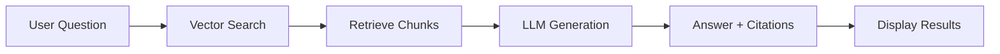

# Q&A Conversations

Ask natural language questions about your contracts and get answers with citations.

---

## Overview

The Q&A feature uses RAG (Retrieval-Augmented Generation) to answer questions about your contracts by:
1. Searching vector embeddings for relevant content
2. Retrieving relevant document chunks
3. Generating answers using LLM with citations
4. Providing page numbers and excerpts

---

## RAG Pipeline Flow

---

## Starting a Conversation

### Create Conversation

1. Navigate to **Q&A** page
2. Click **New Conversation**
3. Enter optional title (auto-generated if empty)
4. Conversation is created and ready

### Conversation List

All conversations are listed in the sidebar:
- **Title**: Conversation name
- **Last Updated**: Most recent activity
- **Message Count**: Number of Q&A pairs

---

## Asking Questions

### Question Types

| Question Type | Example |
|--------------|---------|
| **Clause-Specific** | "What are the termination terms?" |
| **Comparison** | "Compare liability caps across documents" |
| **Specific Details** | "What is the payment schedule?" |
| **Risk Assessment** | "Are there any high-risk clauses?" |
| **General** | "Summarize the key terms" |

### Best Practices

✅ **Good Questions**:
- "What are the termination conditions?"
- "What is the liability cap?"
- "Explain the payment terms"
- "What are the IP ownership rights?"

❌ **Poor Questions**:
- "Tell me everything" (too broad)
- "What's in the contract?" (too vague)
- "Is this good?" (needs context)

---

## Understanding Answers

### Answer Format

Answers include:
- **Answer Text**: Generated response with markdown formatting
- **Citations**: Source references with page numbers
- **Confidence**: Answer confidence score (0-1)

### Citations

Each citation shows:
- **Document Name**: Source document
- **Page Number**: Where information appears
- **Section**: Document section
- **Excerpt**: Relevant text excerpt
- **Similarity Score**: Relevance score

### Citation Highlighting

When viewing answers:
1. Click on a citation
2. PDF viewer opens to the cited page
3. Relevant text is highlighted (if coordinates available)

---

## Conversation History

### Message History

Conversations maintain:
- **User Questions**: All questions asked
- **Assistant Answers**: All generated answers
- **Citations**: All source references
- **Timestamps**: When each message was created

### Context Awareness

The RAG pipeline uses conversation history to:
- Provide context for follow-up questions
- Maintain conversation flow
- Reference previous answers

**Example**:
- Q1: "What is the liability cap?"
- Q2: "Is that standard?" (refers to Q1 answer)

---

## Document Filtering

### Filter by Documents

When asking questions, you can:
1. Select specific documents
2. Search only within selected documents
3. Get answers from filtered set

**Use Cases**:
- Compare specific contracts
- Focus on particular documents
- Exclude irrelevant documents

---

## Conversation Management

### Edit Title

1. Click on conversation title
2. Edit title text
3. Save changes

### Delete Conversation

1. Select conversation
2. Click **Delete**
3. Confirm deletion

**Warning**: Deleting a conversation removes all messages and history.

---

## Exporting Conversations

### Evidence Packs

Generate PDF evidence packs containing:
- All questions and answers
- Supporting citations
- Document excerpts
- Page references

See [Evidence Packs](evidence-packs.md) for details.

---

## Troubleshooting

### No Results Found

**Possible Causes**:
- No documents in workspace
- Documents not processed
- Question too vague
- No relevant content in documents

**Solutions**:
- Verify documents are processed
- Check workspace has documents
- Rephrase question more specifically
- Try different question wording

### Low Quality Answers

- **Rephrase Question**: Be more specific
- **Check Citations**: Verify source relevance
- **Review Documents**: Ensure documents contain relevant content
- **Try Different Question**: Different phrasing may help

### Citations Not Highlighting

- **PDF Format**: Highlighting works best with PDFs
- **Coordinates**: May not be available for all chunks
- **Browser**: Ensure PDF viewer is supported

---

## Best Practices

| Practice | Recommendation |
|----------|----------------|
| **Be Specific** | Ask focused questions |
| **Use Context** | Reference previous answers |
| **Check Citations** | Verify source accuracy |
| **Filter Documents** | Narrow search scope |
| **Export Results** | Save important conversations |

---

## Next Steps

- **[Evidence Packs](evidence-packs.md)** - Generate PDF evidence packs
- **[Document Management](documents.md)** - Upload more documents
- **[Clause Extraction](clause-extraction.md)** - Extract clauses for analysis

