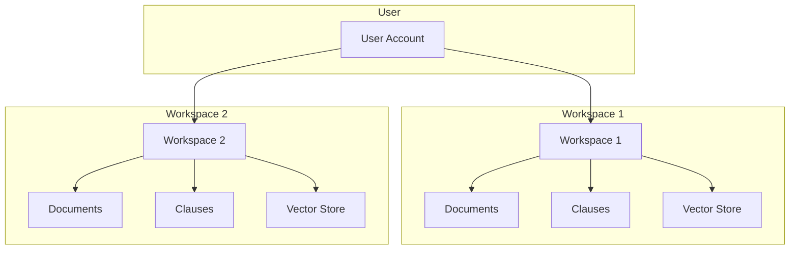

# Workspace Management

Workspaces provide isolated environments for organizing your contracts and documents.

---

## What are Workspaces?

Workspaces are isolated containers that separate:
- Documents
- Clauses
- Conversations
- Vector search indices

Each workspace has its own ChromaDB collection, ensuring complete data isolation.

---

## Workspace Isolation



**Key Points**:
- Documents in one workspace are not visible in another
- Q&A searches only within the active workspace
- Clause extraction is workspace-scoped
- Vector embeddings are isolated per workspace

---

## Creating Workspaces

### Via UI

1. Click **Workspace Selector** (top navigation)
2. Click **Create Workspace**
3. Enter workspace details:
   - **Name**: Required (e.g., "Q4 2024 Contracts")
   - **Description**: Optional
   - **Temporary**: Check if this is a temporary workspace
4. Click **Create**

### Via API

```bash
POST /api/v1/workspaces/
{
  "name": "Q4 2024 Contracts",
  "description": "Contracts for Q4 review",
  "is_temporary": false
}
```

---

## Managing Workspaces

### List Workspaces

All your workspaces are listed in the workspace selector dropdown.

### Switch Workspaces

1. Click workspace selector
2. Select desired workspace
3. UI updates to show workspace-specific data

### Edit Workspace

Currently, workspace names and descriptions cannot be edited after creation. Delete and recreate if needed.

### Delete Workspace

**Warning**: Deleting a workspace permanently removes:
- All documents
- All clauses
- All conversations
- All vector embeddings

**To Delete**:
1. Select workspace
2. Go to Settings (if available)
3. Click **Delete Workspace**
4. Confirm deletion

---

## Workspace Best Practices

| Use Case | Recommendation |
|----------|----------------|
| **Client Projects** | One workspace per client |
| **Time Periods** | Separate workspaces for Q1, Q2, etc. |
| **Contract Types** | Separate by type (vendor, SaaS, etc.) |
| **Temporary Reviews** | Use temporary workspaces |
| **Team Collaboration** | Each user has their own workspaces |

---

## Workspace Limits

| Resource | Limit | Notes |
|----------|-------|-------|
| **Workspaces per User** | Unlimited | No hard limit |
| **Documents per Workspace** | Unlimited | Limited by storage |
| **File Size** | 50MB | Per document |
| **Pages per Document** | 100 | Configurable |

---

## Temporary Workspaces

Temporary workspaces are useful for:
- Quick one-off reviews
- Testing document processing
- Temporary analysis

**Note**: Temporary workspaces behave the same as regular workspaces but may be cleaned up automatically in the future.

---

## Next Steps

- **[Document Management](documents.md)** - Upload documents to your workspace
- **[Clause Extraction](clause-extraction.md)** - Extract clauses from documents
- **[Q&A Conversations](qa-conversations.md)** - Ask questions about workspace documents

